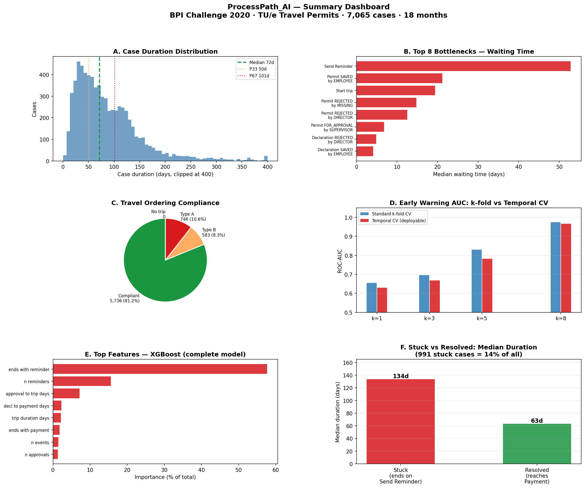
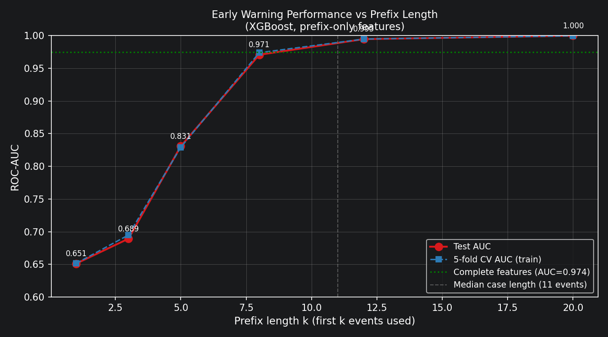
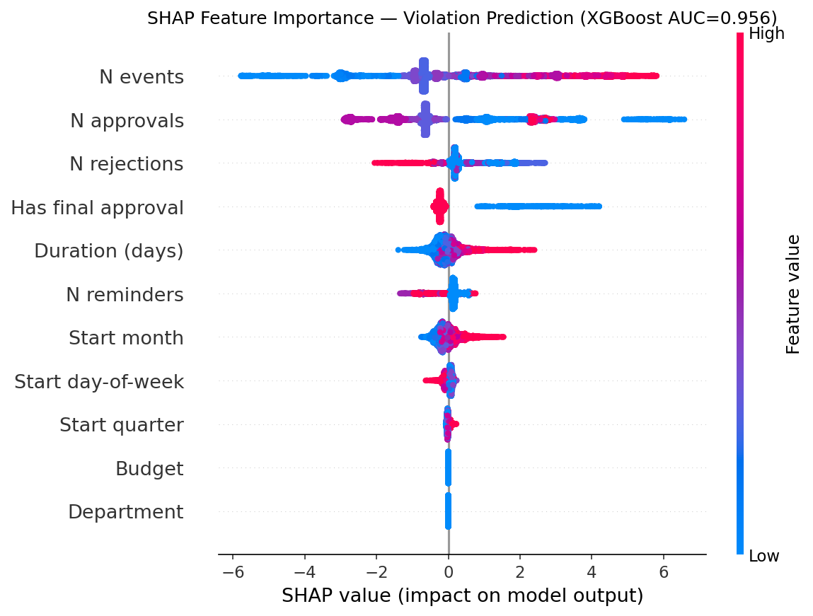

# ProcessPath_AI

End-to-end process mining on a complex multi-stage approval and reimbursement workflow — bottleneck analysis, conformance checking, SHAP-explained early warning model, survival analysis, and root cause analysis.

> **The system identifies high-risk cases before completion, enabling targeted intervention and reduced cycle time.**

**Data:** 7,065 cases · 86,581 events · 51 activities · 18 months (BPI Challenge 2020, TU/e)

[](https://processpathai-fejiac7urktgbcvbbwylhd.streamlit.app)



---

## Results summary

| Finding | Detail |
|---|---|
| 991 cases (14%) permanently stuck | Last event is `Send Reminder` — median duration 134d vs 63d for resolved cases |
| 17.1% travel-ordering violations | 746 Type A (departed before permit submitted), 583 Type B (departed before approval) |
| Scheduling dominates duration | 69% of case duration is voluntary employee scheduling, not admin processing |
| **Deployable early warning model** — k=8 events | AUC **0.810** (leakage-free, temporal CV) — triggers at `Permit FINAL_APPROVED` |
| Retrospective explanatory model — complete features | AUC **0.967** using full process information (not deployable — future leakage) |
| Data drift confirmed | `elapsed_days` feature halved from 2017Q1 → 2018Q4; k-fold overstates AUC by +0.048 |
| Temporal leakage identified & corrected | `elapsed_days` alone achieves AUC 0.833 — excluded from deployed model (Notebook 10) |
| Remaining time prediction at k=8 events | MAE **12.4 days** — P10/P50/P90 quantile intervals, 80.8% coverage (Notebook 11) |
| Survival analysis (all 7,065 cases) | KM median 72.4d · Cox concordance **0.814** · 14% right-censored (Notebook 12) |
| Violation root cause analysis | 44.9% of cases have conformance violations (fitness < 1.0); DT AUC **0.876**, XGB AUC **0.956** — department, duration, and event count are dominant drivers (Notebook 13) |
| **Transferability — BPIC 2017 loan applications** | Same pipeline on 31,509 loans · 475K events: early warning AUC **0.647** at k=8; signal concentrates at offer-creation stage (k=10+, AUC 0.851) vs permit workflow where signal is distributed from event 1 (Notebook 14) |

### Early warning performance vs prefix length



*AUC rises from 0.65 at the first event to 0.81 (leakage-free) by event 8 — well before the median case length of 11 events.*

### SHAP feature importance — violation prediction (XGBoost AUC 0.956)



*Cases with many events and few approvals drive the highest violation risk; department and budget contribute less than process behaviour.*

---

## Potential applications

The methodology is domain-agnostic. The same pipeline applies directly to:

- **Maintenance work orders** — predict overdue orders, identify bottleneck approval steps
- **Procurement workflows** — flag purchase requests at risk of SLA breach
- **Drilling approvals** — early warning on permits likely to stall at regulatory stages
- **Intervention planning** — estimate remaining time and survival probability for field operations
- **Asset integrity workflows** — root cause analysis on inspection deferral patterns

---

## Notebooks

Run in order. Each notebook is self-contained and writes its outputs to `outputs/`.

| # | Notebook | What it does |
|---|---|---|
| 01 | `01_initial_exploration.ipynb` | Case/event stats, variant frequency, time coverage |
| 02 | `02_process_structure.ipynb` | Directly-Follows Graph, transition matrix, happy path |
| 03 | `03_process_discovery.ipynb` | Inductive Miner and Heuristics Miner Petri nets |
| 04 | `04_bottleneck_analysis.ipynb` | Waiting/service time split, stuck cases, scheduling vs admin delay |
| 05 | `05_conformance_analysis.ipynb` | Token replay fitness, travel-ordering violations by department |
| 06 | `06_predictive_analytics.ipynb` | XGBoost / RF / LogReg — AUC 0.967 on complete features (retrospective) |
| 07 | `07_shap_prefix.ipynb` | SHAP explanations + prefix-based early warning (k=1–20) |
| 08 | `08_temporal_cv.ipynb` | Temporal cross-validation, optimism bias, feature drift, concept drift |
| 09 | `09_final_report.ipynb` | 6-panel dashboard, priority matrix, 5 findings, 5 recommendations |
| 10 | `10_leakage_calibration.ipynb` | Leakage audit, ablation study, calibration (Brier score, reliability diagram) |
| 11 | `11_remaining_time.ipynb` | Remaining time regression — XGBoost + quantile P10/P50/P90, temporal CV, SHAP |
| 12 | `12_survival_analysis.ipynb` | Survival analysis — Kaplan-Meier, log-rank tests, Cox PH model, risk groups |
| 13 | `13_violation_root_cause.ipynb` | Violation root cause — decision tree rules, XGBoost, SHAP, department risk exposure |
| 14 | `14_transfer_bpic2017.ipynb` | Transferability — full pipeline on BPIC 2017 loan applications; cross-domain AUC comparison |

---

## Setup

### 1. Python version

The notebooks require **Python 3.13**. The stack (numpy 2.x, xgboost 3.x, shap 0.52, pm4py 2.7) does not work on Python 3.12 with a standard Anaconda environment due to a numpy ABI conflict.

```bash
# Verify you have Python 3.13
python3.13 --version
```

If you need to install it: https://www.python.org/downloads/

### 2. Clone the repo

```bash
git clone https://github.com/djimrastephane/ProcessPath_AI.git
cd ProcessPath_AI
```

### 3. Create a virtual environment

```bash
python3.13 -m venv .venv
source .venv/bin/activate        # Windows: .venv\Scripts\activate
```

### 4. Install dependencies

**To run the Streamlit app only:**
```bash
pip install -r requirements.txt
```

**To run the notebooks** (includes pm4py, jupyter):
```bash
pip install -r requirements-dev.txt
```

### 5. Get the data

The raw event log is not included in this repo (33 MB binary). Download it from the 4TU Research Data repository:

**https://data.4tu.nl/articles/dataset/BPI_Challenge_2020/12703980**

> van Dongen, Boudewijn (2020): BPI Challenge 2020: Travel Permit Data. Version 1. 4TU.ResearchData. dataset. https://doi.org/10.4121/uuid:ea03d361-a7cd-4f5e-83d8-5fbdf0362550

Place the file at:

```
data/raw/PermitLog.xes
```

---

## Streamlit app

**Live demo:** https://processpathai-fejiac7urktgbcvbbwylhd.streamlit.app

**Run locally:**
```bash
pip install -r requirements.txt
streamlit run app/app.py
```

---

## Running the notebooks

### Register the kernel (once)

```bash
python -m ipykernel install --user --name python313 --display-name "Python 3.13"
```

### Interactive (browser)

```bash
jupyter notebook
```

Open notebooks in order from the `notebooks/` directory. Select kernel **Python 3.13** when prompted.

### Headless (execute all, write outputs)

```bash
for nb in notebooks/[01][0-9]_*.ipynb; do
  jupyter nbconvert --to notebook --execute --inplace \
    --ExecutePreprocessor.timeout=600 \
    --ExecutePreprocessor.kernel_name=python313 \
    "$nb"
done
```

Each notebook writes figures to `outputs/figures/` and tables to `outputs/tables/`. Pre-computed outputs are already committed so you can browse results without re-running.

---

## Repository structure

```
ProcessPath_AI/
├── notebooks/          # 14 analysis notebooks (run in order)
├── src/                # Shared loader and helper functions
│   ├── load_event_log.py
│   ├── inspect_log.py
│   └── process_summary.py
├── outputs/
│   ├── figures/        # 63+ PNG charts (pre-computed)
│   └── tables/         # 45+ CSV tables (pre-computed)
├── app/
│   ├── app.py          # Streamlit dashboard (7 pages)
│   └── model/
│       ├── prefix_k8.joblib           # Early warning classifier (AUC 0.810)
│       ├── remaining_time_k8.joblib   # Remaining time regressor (MAE 12.4d)
│       └── survival_cox_k8.joblib     # Cox PH model (concordance 0.814)
├── data/
│   └── README.md       # Data download instructions
├── requirements.txt
├── requirements-dev.txt
└── main.py             # CLI entry point (prints dataset summary)
```

---

## Tech stack

| Library | Version | Purpose |
|---|---|---|
| pm4py | 2.7.22.5 | XES loading, DFG, Petri nets, conformance |
| pandas / numpy | 2.x | Data wrangling |
| scikit-learn | ≥1.3 | Preprocessing, CV, metrics |
| xgboost | 3.x | Gradient boosting classifier |
| shap | 0.52 | Feature attribution (TreeExplainer) |
| lifelines | ≥0.30 | Survival analysis (Kaplan-Meier, Cox PH) |
| matplotlib | ≥3.7 | All figures |

---

## Citation

If you use this dataset, please cite:

> van Dongen, Boudewijn (2020): BPI Challenge 2020: Travel Permit Data. Version 1. 4TU.ResearchData. dataset. https://doi.org/10.4121/uuid:ea03d361-a7cd-4f5e-83d8-5fbdf0362550

---

## License

MIT
